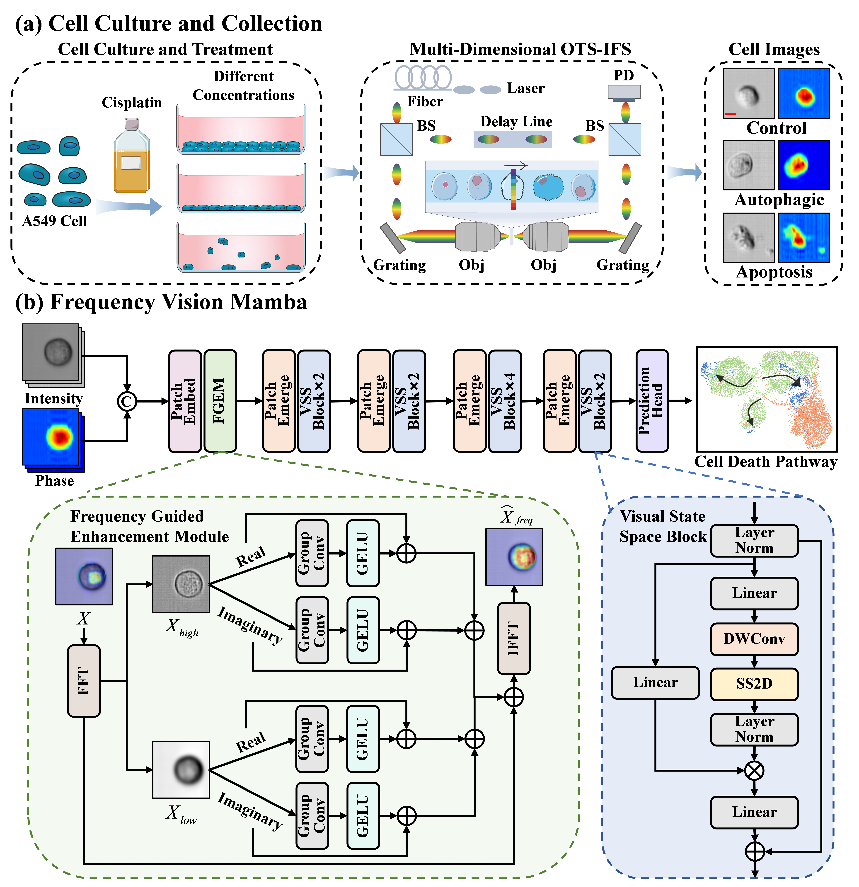

<h2 align="center">FViM: Frequency Vision Mamba for Label-Free Cell Death Pathway Prediction in Lung Cancer Chemotherapy</h2>

<p align="center">
  <b>Our work has been accepted by <i>MICCAI 2025</i>!<br>
</p>

## Overview
<p align='center'>
    
</p>

**Figure 1. Overview of the proposed pipeline. (a) Flow diagram of cell sample preparation and analysis. Scale bar: 10 µm. (b) Flow diagram of the frequency vision Mamba.**

**_Abstract -_** Chemotherapy is the standard first-line treatment for lung cancer, and cellular death is an inevitable consequence of the process. However, current methods lack high-throughput, label-free approaches for accurately assessing cell death, and existing techniques struggle to capture cellular heterogeneity, complicating the prediction of lung cancer prognosis. Therefore, we propose frequency vision Mamba (FViM) for label-free cell death pathway prediction in lung cancer chemotherapy. Specifically, we introduce multi-dimensional optical time-stretch imaging flow cytometry (OTS-IFC) to capture high-throughput, multi-dimensional cell images under various cell death states. To effectively extract key features that are highly indicative of cellular heterogeneity, we propose FViM that integrates modeling remote dependencies of Mamba alongside frequency domain analysis of Fourier Transform. FViM first employs the frequency guided enhancement (FGE) module to enhance cellular detail features in the high-frequency domain, while reinforcing global contextual features in the low-frequency domain. The enhanced features are then processed through the Mamba-based visual state space block, which models the intricate relationships between different visual states, achieving a holistic prediction of cell death states. Experimental results demonstrate that FViM outperforms existing state-of-the-art (SOTA) methods. Notably, FViM successfully predicts cell death pathways in response to increasing cisplatin concentrations, demonstrating its potential for effective and promising applications in lung cancer chemotherapy. Our code is available at https://github.com/yzygit1230/FViM.


## Experimental Results

<p align='center'>
    
</p>

**Figure 2. Qualitative and quantitative performance of FViM in cell death pathway prediction at different drug concentrations. (a) UMAP diagram of control, autophagy, and apoptosis cells clustering trend. (b) Quantitative detection results of control, autophagy, and apoptosis cells. (c) Grad-CAM results.**

### Dataset Preparation
Put the dataset as follows:
```text
Celldeath
├── train
│   ├── 0
│   │   ├── inten
│   │   │   ├── 1.tiff
│   │   │   ├── 2.tiff
│   │   │   ├── ...
│   │   ├── pha
│   │   │   ├── 1.tiff
│   │   │   ├── 2.tiff
│   │   │   ├── ...
│   ├── 1
│   │   ├── inten
│   │   │   ├── 1.tiff
│   │   │   ├── 2.tiff
│   │   │   ├── ...
│   │   ├── pha
│   │   │   ├── 1.tiff
│   │   │   ├── 2.tiff
│   │   │   ├── ...
│   ├── 2
│   │   ├── inten
│   │   │   ├── 1.tiff
│   │   │   ├── 2.tiff
│   │   │   ├── ...
│   │   ├── pha
│   │   │   ├── 1.tiff
│   │   │   ├── 2.tiff
│   │   │   ├── ...
├── val
│   │   │   ├── ...
├── test
│   │   │   ├── ...
```

## Train
Modify the paths in lines 17 to 62 of the train.py, then simply run:

```python
python train.py
```

## Test
Modify the paths in lines 18 to 54 of the eval.py, then simply run:

```python
python eval.py
```